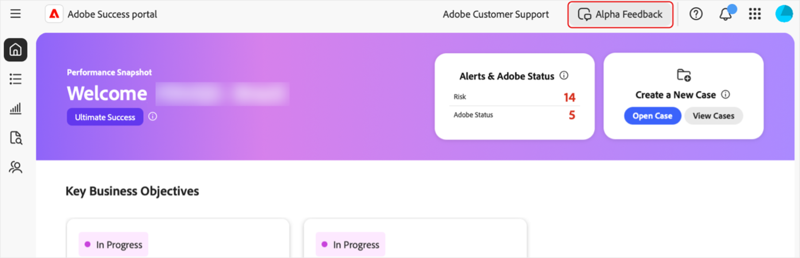

# Access the [!DNL Adobe Success] portal 

This guide explains how to log in to the [!DNL Adobe Success] portal and receive assistance if you encounter access issues. 

You will receive a notification from the **[!UICONTROL Success]** portal team confirming your access. This message will include login details.   

1. Go to [https://experience.adobe.com/](https://experience.adobe.com/). 
1. Sign in with your Adobe ID. 
1. Select the **[!UICONTROL Success portal (Alpha)]** icon.

    ")

1. Once logged in, you see five tabs: 

    

   * Home  
   * **[!UICONTROL Action Plan]** 
   * **[!UICONTROL Value Tracker]** 
   * **[!UICONTROL Support & Insights]**
   * **[!UICONTROL Support Engagement Plan]**

## Troubleshooting and support 

If you experience issues accessing the portal or its features, reach out to our team using the [Alpha Teams channel](https://teams.microsoft.com/l/channel/19:h-GcuAZs9uF05rervqTdx2U27ohYINuRUIfbMte9B-U1@thread.tacv2/General?groupId=02b87789-3475-47e4-94c1-0981f63ae89f&tenantId=fa7b1b5a-7b34-4387-94ae-d2c178decee1).    

You can use the **[!UICONTROL Alpha Feedback]** button on the portal to submit feedback. 

>[!NOTE]
>
>The feedback tool is not a dedicated support channel. It is not suitable for urgent login issues.

