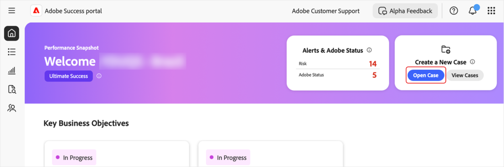
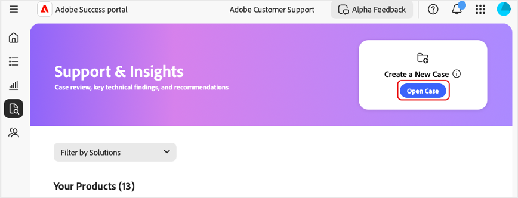
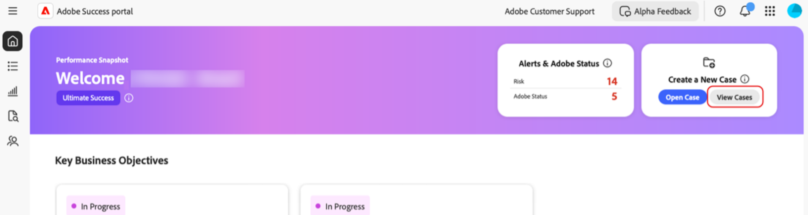
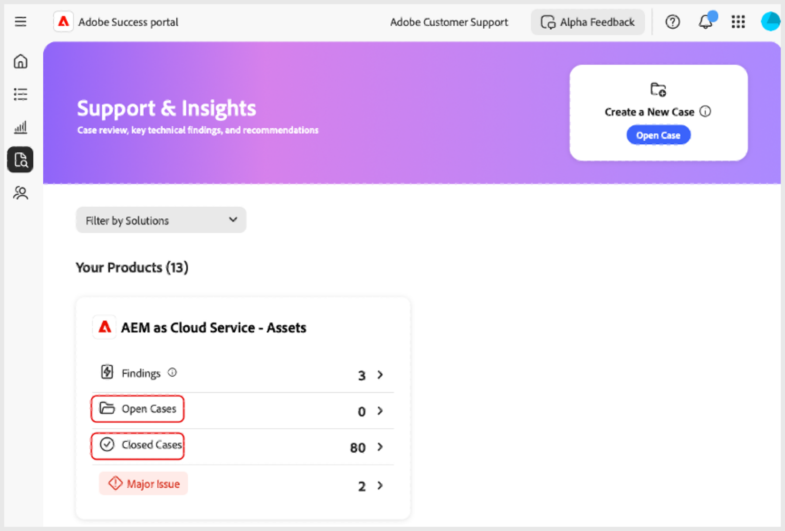
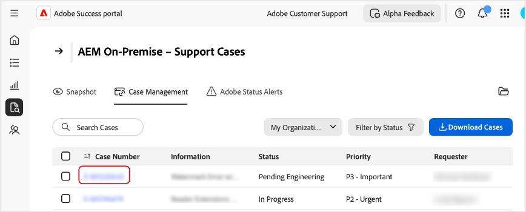
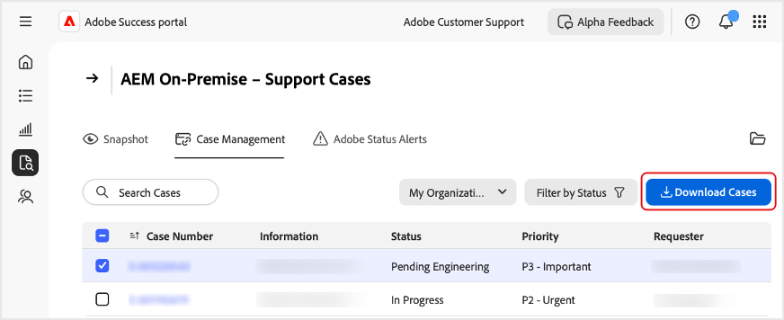

# Create and manage cases in the [!DNL Adobe Success] portal

This guide explains how to create, view, and download reports for cases in the [!DNL Adobe Success] portal. 

## Open a case

You can open a case from the Home tab or the **[!UICONTROL Support & Insights]** tab.

To access the **[!UICONTROL Open Case]** page from the Home tab:

1. Go to the Home tab.
1. Select **[!UICONTROL Open Case]**. 

   

1. Fill in the required fields:
   1. **[!UICONTROL Select a product]**.
   1. **[!UICONTROL Case Title]**.
   1. **[!UICONTROL Case Description]**.
1. Select **[!UICONTROL Submit Case]**.

   

To access the **[!UICONTROL Open Case]** page from the **[!UICONTROL Support & Insights]** tab.

1. Go to the **[!UICONTROL Support & Insights]** tab.
1. Select **[!UICONTROL Open Case]**.

   

Follow the same steps as above to complete and submit the case.

## View a case

You can view a case from the Home tab or the **[!UICONTROL Support & Insights]** tab. 

To access the **[!UICONTROL View Cases]** page from the Home tab: 

1. Go to the Home tab. 
1. Select **[!UICONTROL View Cases]**.

   

1. Select the product card you want to view, then choose **[!UICONTROL Open Cases]** or **[!UICONTROL Closed Cases]**.

   >[!NOTE]
   >
   >You can also select the **[!UICONTROL Support & Insights]** tab to quickly access product cards with **[!UICONTROL Open Cases]** or **[!UICONTROL Closed Cases]** links.

   

1. Click the **[!UICONTROL Case Number]** to view case details.  

   

## Download case reports

To download PDF reports on your cases: 

1. Navigate to the Home tab.
1. Select **[!UICONTROL View Cases]**.

   

1. Select the product card you want to view, then choose **[!UICONTROL Open Cases]** or **[!UICONTROL Closed Cases]**. 

   >[!NOTE]
   >
   >You can also select the **[!UICONTROL Support & Insights]** tab to quickly access product cards with links to **[!UICONTROL Open Cases]** or **[!UICONTROL Closed Cases]**.

   

1. On the [Product] - Support Cases page, select the checkbox next to the case you want to download and select **[!UICONTROL Download Cases]**.

   
