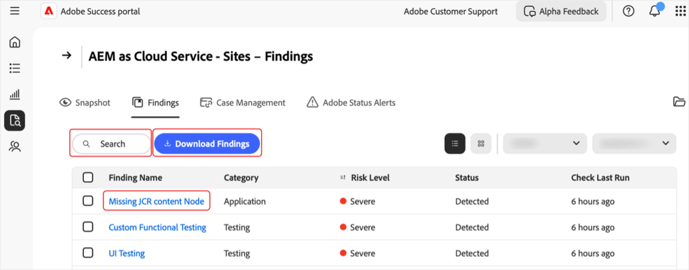
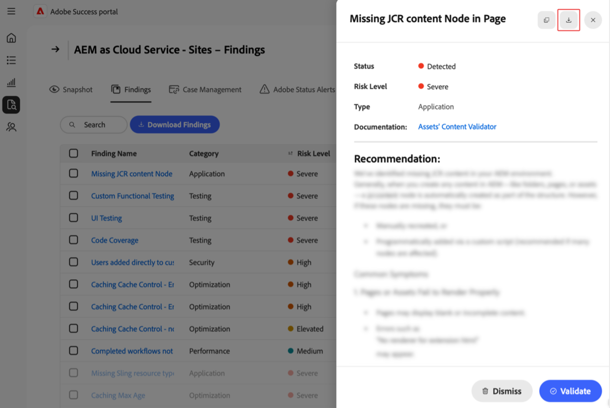
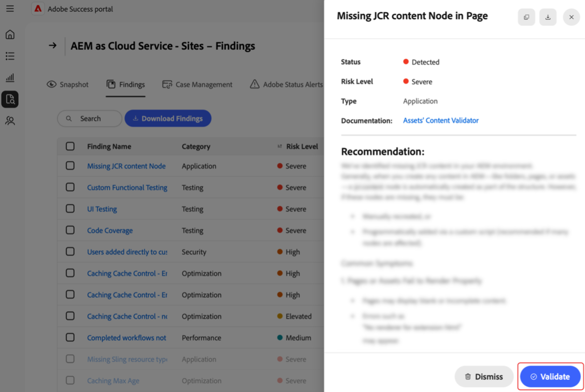

# Manage findings in the Adobe Success portal

This guide explains how to access, interpret, and act on findings in the Adobe Success Portal to help you proactively manage product performance, security, and functionality risks. 

The Adobe Success portal **[!UICONTROL Findings]** page displays issues or risks detected in your Adobe product instance. Findings include performance, security, and functionality issues, along with their status and risk level. Monitoring this page helps you address problems early – before they affect your environments. 

**What are findings?**

Findings are Support Insights alerts shown in the Adobe Success portal. They highlight potential issues in your Adobe product setup – such as performance slowdowns, security risks, or incorrect configurations. These alerts are based on telemetry data collected from tools like APIs, [!DNL New Relic], and [!DNL Splunk].  

**How are findings created?**

Adobe teams regularly study the most common support issues and trends. Based on the insights they add new checks to the system. Once a day, the Success portal scans product data to detect issues – such as misconfigurations, stuck jobs, or anything that could lead to a system outage. If a check finds something outside the safe range (as defined by Adobe’s product and support teams), it shows up as a finding.  

**Why are findings important**

Reviewing findings regularly helps catch problems early—before they affect your system or customers. This proactive approach improves system stability, reduces downtime, and supports best practices.  

**How to fix findings**

Each finding includes recommendations and clear instructions on how to resolve the issue—along with links to relevant documentation, if available. Share these findings with your IT, Engineering team, or Adobe partner, and work together to address them. Fixing these issues early helps prevent bigger problems and keeps your system running smoothly. 

## Access findings 

To view insights for a product: 

1. Navigate to **[!UICONTROL Support & Insights]**. 
1. Select the relevant product card. Select the **[!UICONTROL Findings]** tab. 

     

1. You see a list of all findings for your selected product.

     

1. From here, you can:

     

    * Search for specific entries. 
    * Export the list of findings by selecting **[!UICONTROL Download Findings]**. To export a report for one finding, select the checkbox next to the relevant finding under the column **[!UICONTROL Finding Name]**. If you do not select a finding, the PDF by default contains a list of all findings.  
    * See details on a finding, including a recommended resolution by selecting a finding under **[!UICONTROL Finding Name]**. The Finding details page displays the selected finding with additional context and a recommendation. To see this report select the download arrow. 

      

 
## Action findings 

Follow these steps to validate whether each finding is still applicable or can be dismissed. Note: Standard checks are run on your instances. If the checks do not find that the issue is present in your instance there is a status of **[!UICONTROL Not Detected]**. 

1. Navigate to **[!UICONTROL Support & Insights]**. 
1. Select the relevant product card. 
1. Open the **[!UICONTROL Findings]** tab. You see all the findings for your selected product.  
1. Select an entry under **[!UICONTROL Finding Name]**. On the Findings detail you can: 
    * Select **[!UICONTROL Validate]** to check if the issue is still present (the **[!UICONTROL Validate]** button is designed as confirmation that the issue has been resolved): 

     

   * If the issue is still present the following message displays: *[!UICONTROL Validation complete. Finding still detected]*. Use the information and recommendation on the Finding details page to investigate and resolve.  
   * If the issue is no longer present the following message displays: **[!UICONTROL Validation Complete. Finding no longer detected]**. When the finding is no longer detected, the finding grays out and the status changes to **[!UICONTROL Not Detected]**. Findings with **[!UICONTROL Not Detected]** status are located at the bottom of the findings list.  
   * If the issue is not applicable or relevant to you, you can dismiss it by selecting the **[!UICONTROL Dismiss button]**. When the finding is dismissed the finding grays out and the status changes to **[!UICONTROL Dismissed]**.  Findings with **[!UICONTROL Dismissed]** status are located at the bottom of the findings list.  

## Understand findings

* **[!UICONTROL Finding Name]** – Select for detailed insights and recommended resolution steps.  
* **[!UICONTROL Type]** – Categorized as *Functionality*, *Performance*, and *Security*. 
* **[!UICONTROL Risk Level]** – Severity indicator, with visual indicators.  
* **[!UICONTROL Status]** – The Finding’s current state (e.g., *Detected*, *Not Detected*, *Dismissed*). 
* **[!UICONTROL Check Last Run]** – Timestamp of the last check that updated the finding.  

## Best practices

The **[!UICONTROL Findings]** page lists recommendations with the following risk levels: **[!UICONTROL High]**, **[!UICONTROL Elevated]**, and **[!UICONTROL Medium]. *[!UICONTROL High]** is critical, *[!UICONTROL Elevated]** is urgent, and **[!UICONTROL Medium]** is noncritical. To maintain site health and performance: 

Address **[!UICONTROL High risk]** findings promptly, as they pose critical threats. 
Resolve **[!UICONTROL Elevated]** risk issues soon to avoid escalation. 
Monitor **[!UICONTROL Medium]** risk findings regularly and act as needed. 

   

