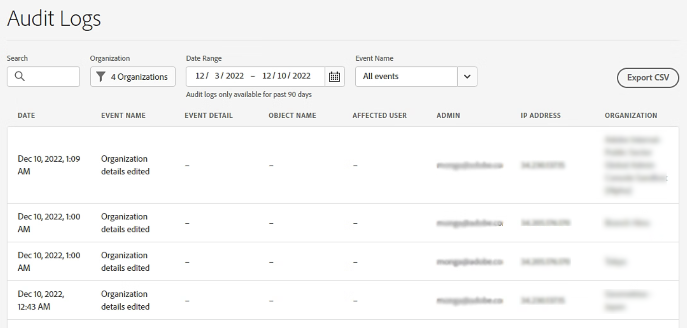
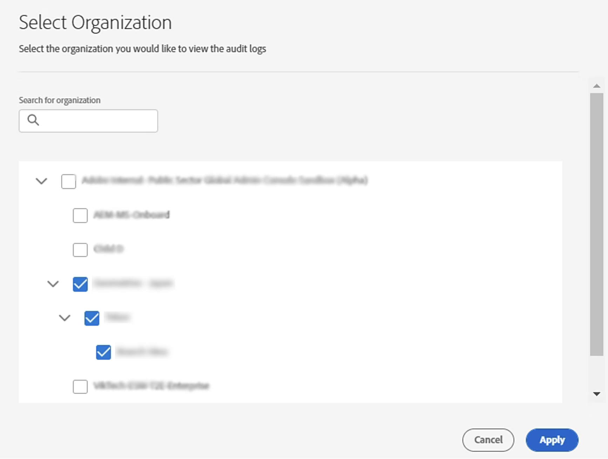
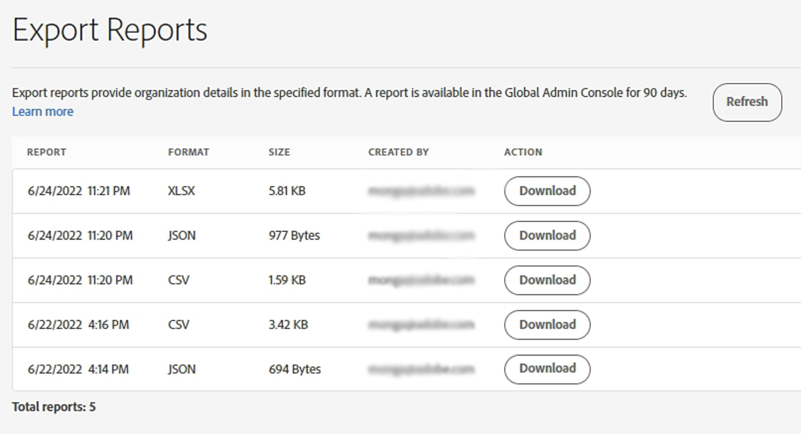

# Download audit logs and export reports

Applies to enterprise.

Global administrators can use the Global Admin Console to access and manage audit information across the organization.

- View, search, and export audit logs to track changes made by administrators.
- Download organization data that has been exported by any global administrator.
- Learn about the benefits of the Global Admin Console and how to gain [access](https://helpx.adobe.com/enterprise/global-admin-console/adopt-global-administration.html).

To get started, sign in to the [Global Admin Console](https://global-admin-console.adobe.com/). Then, open the **[!UICONTROL Insights]** tab, select **[!UICONTROL Audit Logs]** to review activity across your organization.

## View and download audit logs

As a global administrator, you have full visibility into changes made in the Global Admin Console. You can search audit logs across all organizations for actions taken in the last 90 days, including when they occurred and who performed them.
- Audit logs help ensure continued compliance by safeguarding against inappropriate system access and auditing suspicious behavior within your organization.
- The logs available in the Global Admin Console include only events that a global administrator has access to. They do not include user assignments or user events. [Learn more](https://helpx.adobe.com/enterprise/using/admin-console.html) about the different capabilities each console offers.
- The logs cover events for all organizations in the hierarchy, allowing you to search audit logs across all organizations at once.

>[!NOTE]
>
> As a system administrator in an [Adobe Admin Console](https://adminconsole.adobe.com/904D53815F608E410A495FD4@AdobeOrg/overview) organization, you can use the [Audit Log](https://helpx.adobe.com/enterprise/using/audit-logs.html) to review user assignments and user events.

## Access audit logs

To view or download audit logs for your organization:

1. Sign in to the [Global Admin Console](https://global-admin-console.adobe.com/insights).
2. Select **[!UICONTROL Insights]** > **[!UICONTROL Audit Logs]**.
The audit logs display the following information for filtered events:

      | Field | Description |
      |------|-------------|
      | Date | Date and time of the event, shown in the local time zone |
      | Event Name | Description of the action performed |
      | Event Detail | Additional event details, if available |
      | Object Name | Product, product profile, or user group involved in the event |
      | Affected User | Email address of the affected user, if applicable |
      | Admin | Email address of the admin who performed the action. System is displayed if the action was performed by an Adobe backend system |
      | IP Address | IP address of the machine where the action was taken. Usually reflects the physical location, but could be a proxy server or VPN address. |
      | Organization | Name of the organization affected by the event |

  >[!NOTE]
  >
  > Actions performed by system administrators in child organizations of the selected organization are also included in the audit logs. Learn more about how system administrators can [track changes](https://helpx.adobe.com/enterprise/using/audit-logs.html) made in the Admin Console.

3. You can filter audit logs using the following options:

- Search by affected user or admin.
- Select one or more organizations.
- Define a date range.
- Filter by event name.
- You can combine filters to narrow results, such as viewing events from the last seven days for a specific organization.

  

  

4. To export audit logs, select **[!UICONTROL Export CSV]** to export filtered results. The results are downloaded in CSV format.

For details about the fields included in the export, see [Log Schema](https://helpx.adobe.com/enterprise/global-admin-console/log-schema.html).

  >[!NOTE]
  >
  >Exported audit log reports are retained for 90 days after generation.

## Understand your audit log report

The exported audit log report includes the following fields for each organization:

| Field | Description |
|------|------------|
| id | Event ID |
| eventTime | Date and time of the event (local time zone) |
| eventType | Name of the event |
| eventSubType | Additional event details, if available |
| actorEmail | Email of the admin who performed the event, or System |
| targetUserEmail | Email of the affected user, if applicable |
| targetGroupName | Affected user group, if applicable |
| targetProductName | Affected product, if applicable |
| targetProfileName | Affected product profile, if applicable |
| ipAddress | IP address of the machine where the action was taken. Usually reflects the physical location, but could be a proxy server or VPN address. |
| organizationName | Name of the affected organization |

## Download export reports

When any global administrator exports organization data from the [Global Admin Console](https://global-admin-console.adobe.com/insights), the report is processed and made available under the **[!UICONTROL Insights]** tab in **[!UICONTROL Export Reports]**.
- All export reports generated by any global administrator are stored in one centralized location.
- Reports are retained for 90 days and can be downloaded at any time during that period.
- This capability is especially useful when managing large organizational hierarchies, reusing reports generated by other admins, or comparing reports without storing them locally.

## Download an export report

To download an export report:

1. Sign in to the Global Admin Console.
2. Select the **[!UICONTROL Insights]** tab.
3. Select **[!UICONTROL Export Reports]**.
4. Locate a report generated within the last 90 days.
5. Select **[!UICONTROL Download]**.

If a newly generated report does not appear, select **[!UICONTROL Refresh]**.

## Export report fields

| Field | Description |
|------|------------|
| Report | Date and time the report was generated (local time zone) |
| Format | File format (CSV, JSON, XLSX) |
| Size | File size |
| Created By | Email address of the admin who generated the report |
| Action | Link to download the report |

