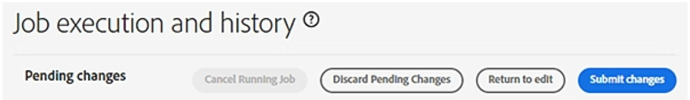

# Execute pending jobs

This feature applies to Enterprise organizations using the [[!DNL Global Admin Console]](https://global-admin-console.adobe.com/).

- Changes in the [[!DNL Global Admin Console]](https://global-admin-console.adobe.com/) are completed in two phases:

    1. **Edit phase**: Make changes to organizations or allocate products.
    2. **Execution phase**: Review and execute pending changes so they take effect.

- To ensure that all changes made in the [[!DNL Global Admin Console]](https://helpx.adobe.com/enterprise/global-admin-console/adopt-global-administration.html) are implemented and take effect, select the [[!UICONTROL Job Execution]] tab and proceed with executing the pending changes.

  Sign in to the [[!DNL Global Admin Console]](https://global-admin-console.adobe.com/)

## Persistence and visibility of changes

### Change persistence

- You can sign out and return later without losing pending changes.
- Unexecuted changes:
    - Are discarded after 30 days.
    - Are cleared when the session ends, such as when the browser tab or window is closed.

> [!NOTE]
>
> Execute important changes promptly to ensure they are applied successfully.

### Multiple administrators and conflicts

- Two administrators working in the same organization:
    - Do not see each other's unexecuted changes.
    - See changes only after:
        - Execution, and
        - Refreshing the display or signing in again.
- Unexecuted changes can conflict with already executed changes.

### Conflict handling

Conflicts are reported:
- At execution time, or
- When data is refreshed (for example, after signing out and signing back in).

## Executing pending changes

As a global administrator, you can review and execute pending changes from the [[!UICONTROL Job Execution]] tab.

### Steps to execute changes

1. Sign in to the [[!DNL Global Admin Console]].
2. Select the [[!UICONTROL Job Execution]] tab from the left navigation panel.
3. Review the pending changes.
4. Select [[!UICONTROL Submit Changes]] to execute them.

After you submit the job:

- The job enters the execution queue.
- The status is [[!UICONTROL Pending]] while the job runs.
- Adobe recommends executing only one job at a time for predictability and easier troubleshooting.

> [!IMPORTANT]
>
> If an error occurs during execution, any changes that were not successfully applied must be reentered and resubmitted.

### Long-running allocations

If a product allocation takes longer than 12 hours:
- The job is marked as [[!UICONTROL Failed]].
- Any subsequent pending tasks in that job are not executed.

## Cancel a running job

You can cancel a job that is currently executing from the [[!UICONTROL Job Execution]] tab.

### Steps to cancel a running job

1. Sign in to the [[!DNL Global Admin Console]].
2. Select [[!UICONTROL Job Execution]].
3. Select [[!UICONTROL Cancel Running Job]].

### Cancellation behavior

1. The job is stopped at the end of the current step.
2. The job does not stop in the middle of a step.
3. Some steps may take minutes or hours to complete.
4. During this time, the job may stay in a [[!UICONTROL Canceling]] state.

> [!NOTE]
>
> Plan cancellations with the understanding that completion of the current step may significantly delay when the job stops.

## View job history

- To view jobs executed in the last 30 days:

    1. Sign in to the [[!DNL Global Admin Console]].
    2. Select [[!UICONTROL Job Execution]].
    3. Scroll to the bottom of the page.
    4. Select [[!UICONTROL Recent Jobs]].

- Recent jobs display:
    - Submitted **job commands**.
    - **Errors** and **warnings** associated with execution.

> [!NOTE]
>
> Subsequent renames or deletions of related objects **do not affect** how commands are displayed in the job history. The history reflects the state at submission time.
