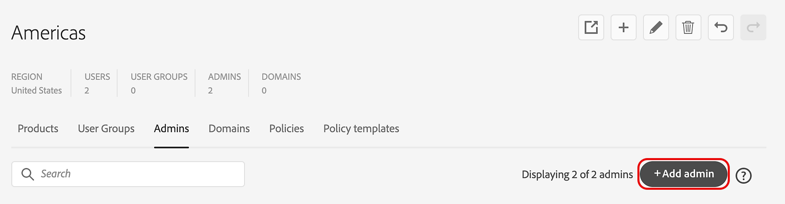
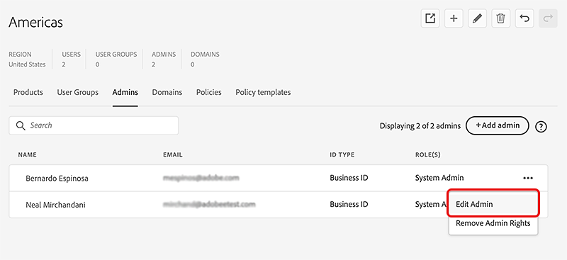
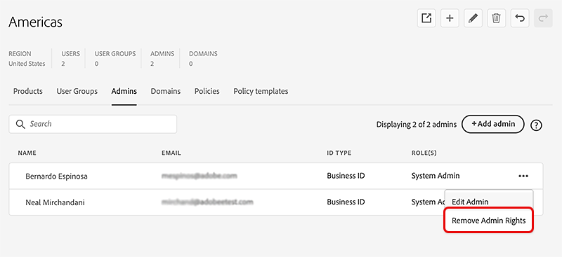

# Manage administrators  

*Applies to enterprise.*

Explore global administrator capabilities and learn how to delegate and distribute the administration of users, product licenses, and groups to admins for each individual organization.

In the Global Admin Console you can select an organization and navigate to the **[!UICONTROL Admins]** tab to add, edit, or remove admin rights. To learn more, refer to [Adopt global administration](https://experienceleague.adobe.com/en/docs/support-resources/adobe-support-tools-guide/adobe-admin-console/adopt-global-administration). Go here to [sign in to the Admin Console](https://adminconsole.adobe.com). 

The Global Admin Console introduces a role called the global administrator. This role is distinct from a system administrator and allows you to do the following:

- View the global landscape of your total Adobe investment across all Admin Consoles added to the Global Admin Console hierarchy.
- Monitor Adobe license and resource assignments and usage across multiple Admin Consoles.
- Create Admin Consoles or organizations.
- Allocate product licenses from a root or parent Admin Console to child Admin Consoles sitting below within the hierarchy.
- Maintain day-to-day operations while system administrators continue managing their own Admin Consoles. For example, a Global Admin can allocate a product to a child Admin Console but cannot assign it to users. The system admin will receive the seats within their Admin Console and will assign the products to their users.
- Optionally apply organizational policies to any Admin Consoles in the hierarchy.

## Fundamental administrative tasks

The Global Admin Console is designed to work across multiple organizations and Admin Consoles. The following table outlines the different capabilities and where they can be completed—Admin Console or Global Admin Console.

<table>
  <tr>
    <th colspan="2">Task</th>
    <th>Global Admin Console</th>
    <th>Admin Console</th>
  </tr>

  <tr>
    <td colspan="2">Create, reparent, and delete child organizations</td>
    <td align="center">Yes</td>
    <td align="center">No</td>
  </tr>

  <tr>
    <td colspan="2">Work with multiple organizations</td>
    <td align="center">Yes</td>
    <td align="center">No</td>
  </tr>

  <tr>
    <td rowspan="2" valign="middle">Manage administrators</td>
    <td>For one or more organizations</td>
    <td align="center">Yes</td>
    <td align="center">No</td>
  </tr>

  <tr>
    <td>For one organization</td>
    <td align="center">Yes</td>
    <td align="center">Yes</td>
  </tr>

  <tr>
    <td colspan="2">Manage Product Profiles and user groups</td>
    <td align="center">Yes</td>
    <td align="center">Yes</td>
  </tr>

  <tr>
    <td colspan="2">Define and manage policies</td>
    <td align="center">Yes</td>
    <td align="center">No</td>
  </tr>

  <tr>
    <td colspan="2">Allocate products across organizations</td>
    <td align="center">Yes</td>
    <td align="center">No</td>
  </tr>

  <tr>
    <td colspan="2">Allocate products to users</td>
    <td align="center">No</td>
    <td align="center">Yes</td>
  </tr>

  <tr>
    <td colspan="2">Manage users</td>
    <td align="center">No</td>
    <td align="center">Yes</td>
  </tr>

  <tr>
    <td colspan="2">Manage packages</td>
    <td align="center">No</td>
    <td align="center">Yes</td>
  </tr>

  <tr>
    <td colspan="2">Set up domains and directories</td>
    <td align="center">No</td>
    <td align="center">Yes</td>
  </tr>

  <tr>
    <td colspan="2">Manage enterprise storage and encryption</td>
    <td align="center">No</td>
    <td align="center">Yes</td>
  </tr>
</table>

## Manage administrators

You can create a flexible administrative hierarchy that enables fine-grained management of Adobe product access and usage. Similar to the Adobe Admin Console, the Global Admin Console allows you to add system admins, product admins, product profile admins, user group admins, deployment admins, support admins, and storage admins. These admins can perform their respective administrative tasks in the organizations they are the admin of. Apart from these roles, there are two new roles for the global administration: Global Admin and Global Viewer.

Global Admin is a transitive role. Making a user the Global Admin of an organization automatically makes that user a Global Admin of all children of that organization, directly or indirectly. Also, if a new organization is created in the organization hierarchy, all global admins of any parents of that organization will immediately become global admins of the newly created organization.

The following are the capabilities of the Global Admin role:

- Create and delete child organizations
- Set and edit policies
- Set and modify administrative roles
- Add and remove products in child organizations
- Set or change resource allocations for child organizations
- Manage Product Profiles and User Groups

The following are the capabilities of the Global Viewer role:

- View the list of user groups, products, product profiles, administrators, policies set, and resources in the organization and in the child organizations.

## Distributed administration

By managing administrators, a Global Admin can delegate and distribute the administration of users, product licenses, and groups to admins for each individual organization. The admin added to an organization by a global administrator is given the flexibility to manage the organization without having any visibility into the administration of other orgs. So, the Global Admin can delegate administration of resources and users keeping the data on those resources and users isolated.

A Global Admin can create organizations, distribute resources such as products and storage to those organizations, manage identity setup, and create and apply organization policy templates. A system admin added to an organization by a Global Admin can assign products to users, onboard users, create and manage product profiles, and perform other administrative tasks within that organization.

## Add an admin

1. In the [Global Admin Console](https://global-admin-console.adobe.com/), select an organization to edit, then navigate to the **[!UICONTROL Admins]** tab.

1. Select **[!UICONTROL Add Admin]**.

      

1. In the **[!UICONTROL Add Admin]** dialog box, enter the **[!UICONTROL User Details]**: Email, First Name, Last Name, Account Type, and Country Code.

   If you are trying to add an existing user as an admin, choose the same account type as the existing user, otherwise the add operation will fail.

    >[!NOTE]
    >
    > Organizations can have restrictions on which Account Types can be added. These may be based on [policies](https://helpx.adobe.com/enterprise/global-admin-console/update-policies.html) or on other configuration parameters for an organization. Organizations do not allow adding both AdobeID users and BusinessID users at the same time. In general, there should not be users of both types in an organization but depending on the order in which rules are set there may be some users of a particular Account Type that pre-date the application of policies or rules.

1. Select one or more admin roles from the **[!UICONTROL Admin Rights]** section.

   For roles such as product administrator, product profile administrator, and user group administrator, select the specific products, profiles, and groups respectively. 

   

1. Select **[!UICONTROL Save]**.

1. After editing organizations, select **[!UICONTROL Review Pending Changes]**, then select **[!UICONTROL Submit Changes]** to [execute](https://helpx.adobe.com/enterprise/global-admin-console/execute-jobs.html) the changes.

When an admin role is added, the user receives an email notification informing them of the change in their role.

After the administrator is added, they receive an email message inviting them to accept their role and giving them a link to the Admin Console. If they are added as both a global administrator and some other role, they will receive two invitations, one to the Global Admin Console and one to the Admin Console.

## Edit an admin

1. Select an organization to edit and navigate to the **[!UICONTROL Admins]** tab.

1. Select the **[!UICONTROL More Options]** (⋮) icon for the relevant admin, then select **[!UICONTROL Edit Admin]**.

     

1. Update the admin details, then select **[!UICONTROL Save]**.

1. Select **[!UICONTROL Review Pending Changes]** after you are done editing the organizations.

A separate command appears in the pending change list for each added or removed admin role. After reviewing, select **[!UICONTROL Submit Changes]** to [execute](https://helpx.adobe.com/enterprise/global-admin-console/execute-jobs.html) them.

## Remove admin rights

1. Select an organization to edit and navigate to the **[!UICONTROL Admins]** tab.

1. Select the **[!UICONTROL More Options]** (⋮) icon for the relevant admin, then select **[!UICONTROL Remove Admin Rights]**.

     

1. Select **[!UICONTROL OK]** in the confirmation dialog.

1. Select **[!UICONTROL Review Pending Changes]** after you are done editing the organizations. After reviewing, select **[!UICONTROL Submit Changes]** to [execute](https://helpx.adobe.com/enterprise/global-admin-console/execute-jobs.html) them.

After you delete an admin, the user receives an email notification informing them of the loss of access to the admin console for that organization.
