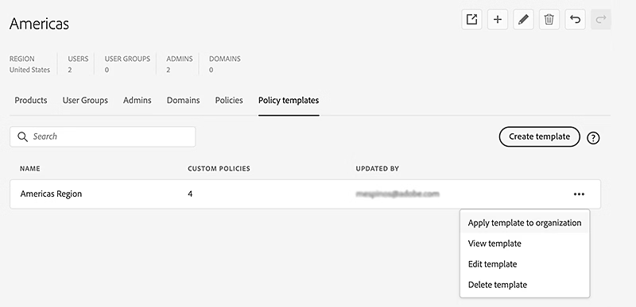

# Manage policy templates in the Global Admin Console

**Applies to:** Enterprise

Learn how global administrators can apply policy templates to any child organization, directly or indirectly from the organization where they are stored in the Global Admin Console.

>[!NOTE]
>
>In the [Global Admin Console](https://helpx.adobe.com/enterprise/global-admin-console/adopt-global-administration.html), select an organization to edit, and navigate to the **Policy Templates** tab to streamline setup and facilitate consistent policy management across organizations.
>
> [Sign in to the Global Admin Console](https://global-admin-console.adobe.com/)

## How policy templates work

Policy Templates are stored with an organization and are visible to all global administrators of that organization. Once applied, the entries from the policy template are individually set in each organization. When a policy template is applied to an organization, each of the entries in the policy template are applied to the organization's policies, replacing existing policy values.

### Locked policy behavior

Updates to locked policies are only performed if the user applying the update is a global administrator of the organization indicated by the **[!UICONTROL Locked By]** icon of the policy being updated.

If the user applying the template has permission to unlock the policy, the policy locks take the values from the template applied (locked or unlocked). If the template indicates that the lock should be left as is, the value of the lock in the policy stays same as before.

### Important Note on saving

>[!NOTE]
>
>Unlike other changes made in the Global Admin Console, edits to policy templates take effect immediately without needing to go through the **[!UICONTROL Review Pending Changes - Submit]** process. However, to implement pending changes in organizations where the policy template is applied, [submission](https://helpx.adobe.com/enterprise/global-admin-console/execute-jobs.html) is required.

## Create a policy template

1. In the [Global Admin Console](https://global-admin-console.adobe.com/), select an organization to edit, then navigate to the **[!UICONTROL Policy Templates]** tab.
1. Select **[!UICONTROL Create Template]**. 
    
     
1. In the **[!UICONTROL Create Policy Template]** dialog box, enter the **name** and **description** for the policy template. The name of the policy template can be a maximum of 100 characters.
1. Select the policies to include in the template.
1. Set values for the selected policies (see [Setting Policy Values](#setting-policy-values) below).
1. Select **Save**.

### Setting policy values {#setting-policy-values}

For each policy included in the template, configure two settings:

* **Allowed / Not Allowed:** Set the slider to the desired value. Learn about [policy details](https://helpx.adobe.com/enterprise/global-admin-console/update-policies.html#policy-details).
* **Lock value:** Modify the lock state of the policy using one of the following options:
  * **Lock** — The policy will be locked after application of the template.
  * **Unlock** — The policy will be unlocked after application of the template.
  * **Keep as is** — The lock state of the policy will be left the same as before the template was applied. 
    
 

## Apply a template to organizations

1. In the [Global Admin Console](https://global-admin-console.adobe.com/), select an organization to edit, then navigate to the **[!UICONTROL Policy Templates]** tab.
1. Select the **[!UICONTROL More Options]**  icon for the relevant policy template, and select **[!UICONTROL Apply template to organization]**. 
    
     
1. Select the organizations to which you want to apply the template. You can select multiple organizations. 
    
     
1. Select **[!UICONTROL Apply template]**.
1. To implement pending changes in organizations where the policy template is applied, select **[!UICONTROL Review Pending Changes]**. After reviewing, select **[!UICONTROL Submit Changes]** to [execute](https://helpx.adobe.com/enterprise/global-admin-console/execute-jobs.html) them.

If all the policy values in the organizations you select already match the values in the template, a message appears notifying that no changes were made. Also, **[!UICONTROL Review Pending Changes]** isn't enabled if there are no other pending edits.

## Edit a template

1. In the [Global Admin Console](https://global-admin-console.adobe.com/), select an organization to edit, then navigate to the **[!UICONTROL Policy Templates]** tab.
1. Select the **[!UICONTROL More Options]** icon  for the relevant template, and select **[!UICONTROL Edit template]**. 
    
     
1. Update the policy template and select **[!UICONTROL Update Now]**.
1. To implement pending changes in organizations where the policy template is applied, select **[!UICONTROL Review Pending Changes]**. After reviewing, select **[!UICONTROL Submit Changes]** to [execute](https://helpx.adobe.com/enterprise/global-admin-console/execute-jobs.html) them.

## Delete a template

1. In the [Global Admin Console](https://global-admin-console.adobe.com/), select an organization to edit, then navigate to the **[!UICONTROL Policy Templates]** tab.
1. Select the **[!UICONTROL More Options]**  icon for the relevant template, and select **[!UICONTROL Delete Template]**. 
    
     
1. Select *Yes* in the dialog box that appears.
