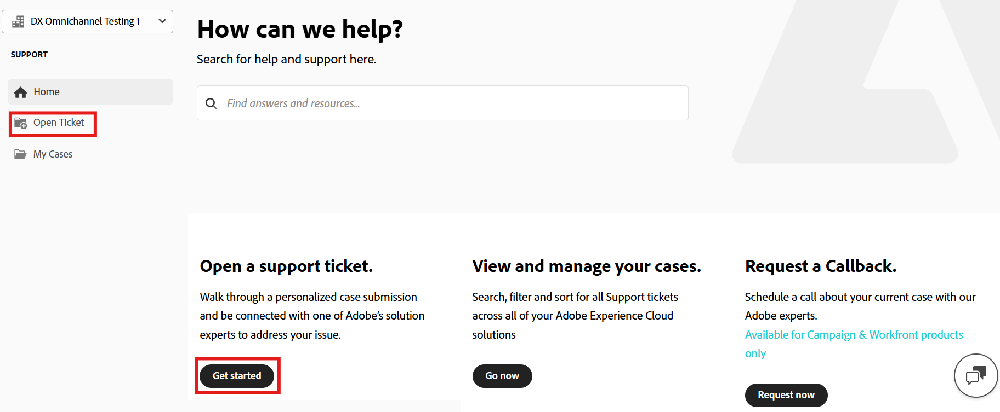

# Adobe Customer Support Experience

## Experience League Support Tickets

Support tickets are now submitted via [Experience League](https://experienceleague.adobe.com/home#support). For instructions on how to submit a support ticket, review the section for [submitting a support ticket](#create-a-support-ticket-with-experience-league).

We are working to improve how you interact with Adobe Customer Support. Our vision is to streamline the support experience by moving to a single entry point, using Experience League. Once live, your organization will be able to easily access Adobe Customer Support; have greater visibility into your service history via a common system across products; and request help via phone, web, and chat through a single portal. 

If you are an Adobe Commerce user, refer to [Submit a support case](https://experienceleague.adobe.com/en/docs/commerce-knowledge-base/kb/help-center-guide/magento-help-center-user-guide#support-case) in the Experience League Support User Guide for Adobe Commerce.

## Support entitled roles needed for case submission {#submit-ticket}

In order to submit a support ticket in [Experience League](https://experienceleague.adobe.com/home#support), you need to have the Support admin role assigned by a System Administrator. Only a System Administrator in your organization can assign this role. Product, Product Profile, and other administrative roles cannot assign the Support admin role and are unable to view the **[!UICONTROL Create Case]** option used to submit a support ticket. To learn more about the different types of admin roles and their entitlements, refer to [Admin roles](admin-roles.md). 

If you are on Commerce, the process for sharing access to work with support cases is different. To learn more, refer to [Shared access: grant privileges for other users to access your account](https://experienceleague.adobe.com/en/docs/commerce-knowledge-base/kb/help-center-guide/magento-help-center-user-guide#shared-access) in the Experience League Support User Guide for Adobe Commerce.

### Adding support entitles roles to an organization

The support admin role is a non-administrative role that has access to support-related information. Support admins can view, create, and manage issue reports.

To add or invite an admin:

1. In the Admin Console, choose **[!UICONTROL Users]** > **[!UICONTROL Administrators]**.
1. Click **[!UICONTROL Add Admin]**.
1. Enter a name or email address.

   You can search for existing users or add a new user by specifying a valid email address and filling the information on the screen.

   

1. Click **[!UICONTROL Next]**. A list of admin roles appears.

To assign a Support Admin role to a user (enable a user to be able to contact support):

1. Select the **[!UICONTROL Support administrator]** option.

   

1. Choose one of the following two options:

   * Option 1: **[!UICONTROL Basic support administrator]**. Select this option if you would like to give the user support access for all solutions (except Marketo Engage).
   * Option 2: **[!UICONTROL Product support administrator]**: Select this option for Marketo Engage support. Select which Marketo Engage instances to give the user support access.

   

1. Once you have made the selections, click **[!UICONTROL Save]**.

The user receives an email invitation regarding the new administrative privileges from `message@adobe.com`.

Users must click **Get started** in the email to join the organization. If new admins do not use the **Get started** link in the email invitation, they would not be able to sign into the Admin Console.

As part of the sign-in process, users may be asked to set up an Adobe profile if they do not have one already. If users have multiple profiles associated with their email address, users must choose **Join Team** (if prompted) and then select the profile associated with the new organization.

For more details follow the [edit enterprise admin role](admin-roles.md#add-enterprise-role) instructions in the administrative roles documentation. Note that only a system administrator for your organization can assign this role. For more information on administrative hierarchy, visit the [administrative roles](admin-roles.md) documentation.

### Create a support ticket with Experience League

>[!NOTE]
>
> Before you submit a support ticket, check Adobe system performance, availability, and known issues on the [Adobe status](https://status.adobe.com) site.

Experience League is a self-service support portal designed to provide personalized assistance and an easy-to-use experience for entitled customers.

1. To create a ticket in [Experience League](https://experienceleague.adobe.com/home#support), select the **[!UICONTROL Support]** tab in the top navigation.

   

1. From the **[!UICONTROL Home]** menu, you can **[!UICONTROL Open a support ticket]**, **[!UICONTROL View and manage your cases]**, **[!UICONTROL Request a callback]**, or access additional learning resources.

   

1. To submit a case, select **[!UICONTROL Open a support ticket]**. You can also select the **[!UICONTROL Open Ticket]** in the sidebar menu.

   

### Fill out the support ticket

After you select **[!UICONTROL Open a support ticket]** or **[!UICONTROL Open Ticket]**, the case creation page appears.

The form uses a guided, multi-step workflow:

* Select the affected Adobe product
* Describe the issue
* Provide system and environment details
* Indicate impact and urgency
* Confirm contact information
* Review and submit the details

Follow these steps to create a support ticket:

1. Click the product name to select the affected product, and then click **[!UICONTROL Next]**.

   

1. In the **[!UICONTROL Issue Details]** section, enter the case title, describe the issue, and provide steps to reproduce.

   

   Include details such as:

   * What you’re trying to do
   * What isn’t working as expected
   * Any recent environment changes
   * Steps you’ve already taken

   As you enter issue details, Experience League displays AI-powered recommendations in a panel next to the form. These recommendations:

   * Suggest relevant documentation or known solutions
   * Help you confirm if the issue is already addressed
   * Reduce the need to submit a case for common issues

   The panel appears without interrupting the case creation process. You can review the recommendations anytime and continue submitting the case if needed.

   

1. Click **[!UICONTROL Next]**.

1. In the **[!UICONTROL System Information]** section, select the environment, and click **[!UICONTROL Next]**.

   >[!NOTE]
   >
   > Based on the selected product, additional fields may appear.

   

1. In the **[!UICONTROL Impact]** section, select the below:
   * Case Priority (P4 - Minor, P3 - Important, P2 - Urgent, P1 - Critical)
   * Business Impact (Small, Medium, Large)

   

   For details on how Case Priority and Business Impact affect support response times, see [Targeted Initial Response Times for Support](https://experienceleague.adobe.com/en/docs/support-resources/data-sheets/overview#targeted-initial-response-times-for-support) in the Success Plans Resources documentation.

1. Click **[!UICONTROL Next]**.

1. In the **[!UICONTROL Contact Information]** section, select the timezone, enter your phone number, add watchers, attach any files if needed, and then click **[!UICONTROL Next]**.

   

1. In the **[!UICONTROL Review & Submit]** section, review your case details and click **[!UICONTROL Submit]**.

   

   The **[!UICONTROL Review & Submit]** step summarizes all the entered information and allows you to:

   * Review all case details in one place
   * Navigate back to any previous step to make edits
   * Return to the review summary without losing progress

After submission:

* The case is logged in Experience League
* You can track updates and communicate with Support through the portal
* Adobe Support responds based on the priority and impact you provided

>[!TIP]
>
> If you don’t see the **[!UICONTROL Open Ticket]** option or the **[!UICONTROL Support]** tab, contact your System Administrator to assign the Support admin role.

>[!NOTE]
>
> If the issue causes outages or serious interruptions to a production system, a phone number is provided for immediate assistance.
