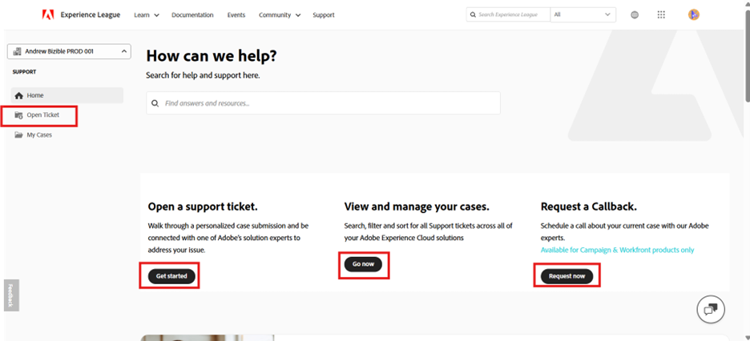

# Adobe Customer Support Experience

## Experience League Support Tickets

Support tickets are now submitted via [Experience League](https://experienceleague.adobe.com/home#support). For instructions on how to submit a support ticket, review the section for [submitting a support ticket](#create-a-support-ticket-with-experience-league).

We are working to improve how you interact with Adobe Customer Support. Our vision is to streamline the support experience by moving to a single entry point, using Experience League. Once live, your organization will be able to easily access Adobe Customer Support; have greater visibility into your service history via a common system across products; and request help via phone, web, and chat through a single portal. 

If you are an Adobe Commerce user, refer to [Submit a support case](https://experienceleague.adobe.com/en/docs/commerce-knowledge-base/kb/help-center-guide/magento-help-center-user-guide#support-case) in the Experience League Support User Guide for Adobe Commerce.

## Support entitled roles needed for case submission {#submit-ticket}

In order to submit a support ticket in [Experience League](https://experienceleague.adobe.com/home#support), you need to have the Support admin role assigned by a System Administrator. Only a System Administrator in your organization can assign this role. Product, Product Profile, and other administrative roles cannot assign the Support admin role and are unable to view the **[!UICONTROL Create Case]** option used to submit a support ticket. To learn more about the different types of admin roles and their entitlements, refer to [Admin roles](admin-roles.md). 

If you are on Commerce, the process for sharing access to work with support cases is different. To learn more, refer to [Shared access: grant privileges for other users to access your account](https://experienceleague.adobe.com/en/docs/commerce-knowledge-base/kb/help-center-guide/magento-help-center-user-guide#shared-access) in the Experience League Support User Guide for Adobe Commerce.

### Adding support entitles roles to an organization

The support admin role is a non-administrative role that has access to support-related information. Support admins can view, create, and manage issue reports.

To add or invite an admin:

1. In the Admin Console, choose **[!UICONTROL Users]** > **[!UICONTROL Administrators]**.
1. Click **[!UICONTROL Add Admin]**.
1. Enter a name or email address.

   You can search for existing users or add a new user by specifying a valid email address and filling the information on the screen.

   

1. Click **[!UICONTROL Next]**. A list of admin roles appears.

To assign a Support Admin role to a user (enable a user to be able to contact support):

1. Select the **[!UICONTROL Support administrator]** option.

   

1. Choose one of the following two options:

   * Option 1: **[!UICONTROL Basic support administrator]**. Select this option if you would like to give the user support access for all solutions (except Marketo Engage).
   * Option 2: **[!UICONTROL Product support administrator]**: Select this option for Marketo Engage support. Select which Marketo Engage instances to give the user support access.

   

1. Once you have made the selections, click **[!UICONTROL Save]**.

The user receives an email invitation regarding the new administrative privileges from `message@adobe.com`.

Users must click **Get started** in the email to join the organization. If new admins do not use the **Get started** link in the email invitation, they would not be able to sign into the Admin Console.

As part of the sign-in process, users may be asked to set up an Adobe profile if they do not have one already. If users have multiple profiles associated with their email address, users must choose **Join Team** (if prompted) and then select the profile associated with the new organization.

For more details follow the [edit enterprise admin role](admin-roles.md#add-enterprise-role) instructions in the administrative roles documentation. Note that only a system administrator for your organization can assign this role. For more information on administrative hierarchy, visit the [administrative roles](admin-roles.md) documentation.

### Create a support ticket with Experience League

>[!NOTE]
>
> Before submitting a support ticket, consider checking Adobe system performance, availability, and solution issues at the [Adobe status](https://status.adobe.com) site. 

The process for submitting support cases is now directly integrated with the Experience League support platform. This is a self-service portal that was recently redesigned to offer more personalization and ease-of-use for entitled customers. 

1. To create a ticket using [Experience League](https://experienceleague.adobe.com/home#support), select the **[!UICONTROL Support]** tab located in the top navigation.
 
1. From the support homepage, you can easily navigate to your open support cases, log a new case, view the top Support articles, or access additional learning sources.
 
1. To submit a case, select **[!UICONTROL Open a support ticket]**. Also select the **[!UICONTROL Open Ticket]** option on the sidebar menu. 

### Fill out the suport ticket

1. After you select **[!UICONTROL Open a support ticket]** you will be directed to the case creation page, where you can enter your product name (Audience Manager, Campaign, Target, etc.), **[!UICONTROL Case title]**, and **[!UICONTROL Case description]**. 

    

   To expedite the troubleshooting process add the following information in the **[!UICONTROL Case description]** field:

   * Clear problem statement
   * Steps to Reproduce
   * Business impact statement
   * Is this a new implementation / feature / development?
   * When was the time the process worked?
   * Troubleshooting steps taken
   * Relevant log data
   * Version number
   * Build info (if relevant)
   * Critical identifiers

1. When selecting any solution, you are asked the following, and some solutions have additional fields:

   * Case Priority (Low, Medium, High, Critical)
   * Business Impact 
   * Customer Timezone (Americas, EMEA, APAC)

   For details on how Case Priority and Business Impact affect support response times, refer to [Targeted Initial Response Times for Support](https://experienceleague.adobe.com/en/docs/support-resources/data-sheets/overview#targeted-initial-response-times-for-support) in the Success Plans Resources Documentation.
 
 

>[!TIP]
>
> If you are unable to see the **[!UICONTROL Create Case]** option or the **[!UICONTROL Support]** tab, you need to contact a System Administrator to assign the Support admin role.

  

  

>[!NOTE]
>
> If the issue results in outages or serious interruptions to a production system, a phone number is provided for immediate assistance.

<!--

## What About the Legacy Systems?

New Tickets/Cases will no longer be able to be submitted in legacy systems as of May 11th.  The [Admin Console](https://adminconsole.adobe.com/) will be used to submit new tickets/cases.

### Existing Tickets/Cases

* Between May 11th and May 20th the legacy systems will remain available to work existing tickets/cases to completion.
* Beginning May 20th the support team will migrate remaining open cases from the legacy systems to the new support experience.  You will receive an email notification regarding how to contact support to continue to work these cases.
-->