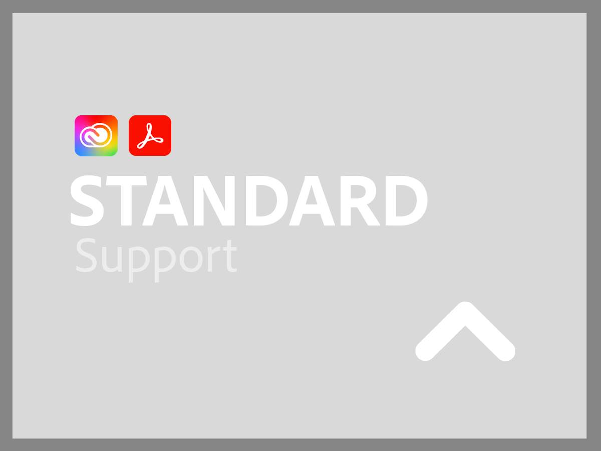
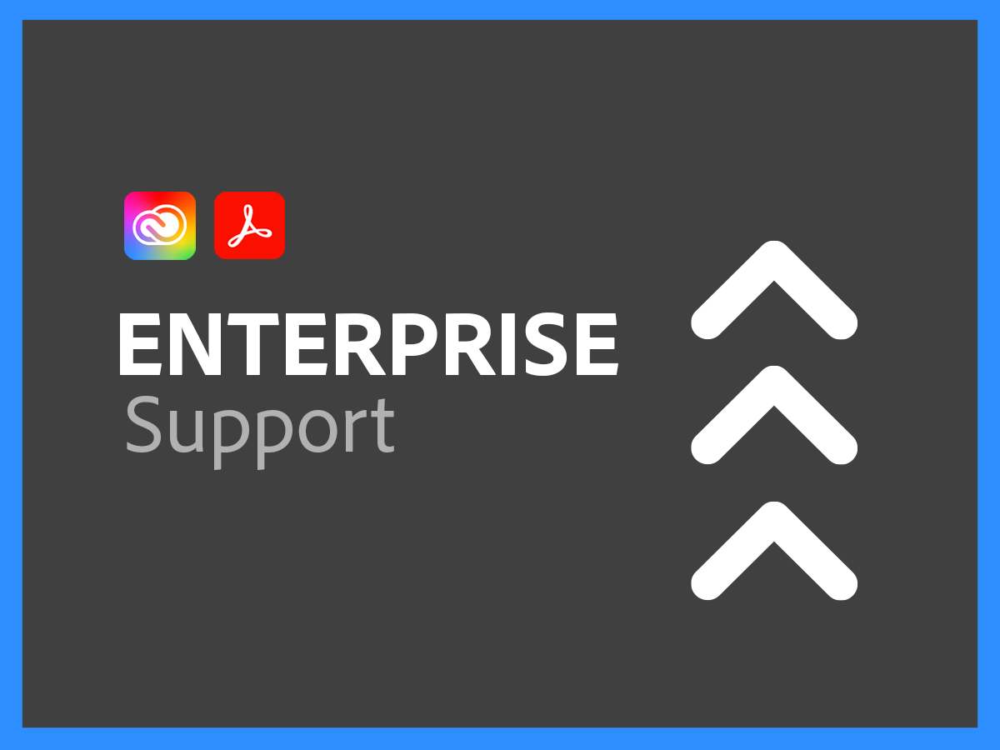

# Support Services for Creative Cloud Enterprise and Document Cloud

Adobe Creative Cloud and Document Cloud Customer Support organization is committed to your success. All applications include a level of support that provides easy access to our highly skilled technical resources for technical assistance.

For more comprehensive needs, we offer Adobe Support Plans that include access to named support professionals and sessions for proactive mentoring and service reviews. No matter how complex your support needs may be, Adobe offers the technical and operational expertise needed to help you achieve peak performance and optimal value from your Adobe applications.

<table style="table-layout:fixed">
<tr>
  <td>
    
    

    <a href="dme-standard.md"><strong>Standard Support</strong></a> (view <a href="assets/DMeStandardSupportDatasheet_2022.pdf" target="_blank">PDF</a>)
    

    
24x7 access for Authorized Users (Admins) to our technical support teams via chat or telephone as well as the ability to log requests for assistance via our support web portal. 

     
  </td>
  <td>
    
    

    <a href="dme-business.md"><strong>Business Support</strong></a> (view <a href="assets/DMeBusinessSupportDatasheet_2022.pdf" target="_blank">PDF</a>)
    

    
Priority routing for support cases to ensure faster connection to more senior support and the ability to leverage an Account Support Lead to receive regular communications and updates for your most critical of support requests.

     
  </td>
</tr>
<tr>
  <td>
    
    

    <a href="dme-enterprise.md"><strong>Enterprise Support</strong></a> (view <a href="assets/DMeEnterpriseSupportDatasheet_2022.pdf" target="_blank">PDF</a>)
    

    
Designated technical contact in the Adobe Support Team with deep experience in your solution will work in partnership with you and your technical teams to ensure timely resolution of all support requests.

     
  </td>
  <td>
    
    

    <a href="dme-elite.md"><strong>Elite Support</strong></a> (view <a href="assets/DMeEliteSupportDatasheet_2022.pdf" target="_blank">PDF</a>)
    

    
Designated technical contact in the Adobe Support Team and a Technical Account Manager who works in partnership with you to provide best-in-class proactive support to ensure you maximize your investment and to help you avoid problems before they happen.

     
  </td>
</tr>
</table>

