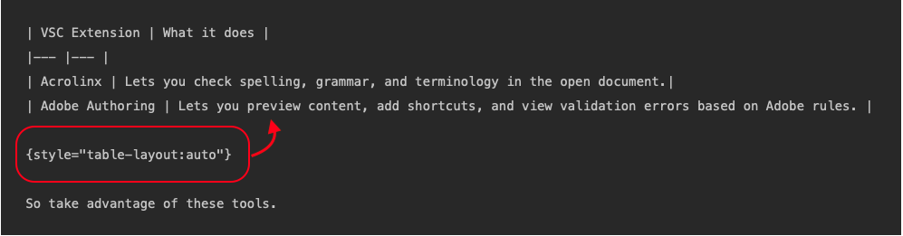

# Tables

Matt was here again and again - 

EDS

Standard Markdown supports only basic tables. For AdobeDocs Markdown, you have the following options:

* Basic Markdown tables
* HTML tables
* Markdown tables with limited HTML syntax for paragraph breaks (`<p>`), line breaks (`<br>`), and basic lists (`<ul>`, `<ol>`).

## Converting HTML tables to Markdown tables

In some cases, you'll want to convert an HTML table to a Markdown table or to Markdown text. Perhaps you need to improve the appearance, resolve a validation error, or make it easier to edit going forward.

Unfortunately, we haven't been able to find a single tool that converts HTML tables well. We usually use some combination of tools to cobble together a decent Markdown table.

| Tool | What it does |
|--- |--- |
|[Markdown Tables Generator](https://www.tablesgenerator.com/markdown_tables) | Good for creating Markdown tables from scratch.|
|[Advanced table converter](https://tableconvert.com/html-to-markdown)| Convert tables from any format to any format. <p>**Note:** Links and images are flattened when converted. |
|[Basic table html > markdown converter](https://jmalarcon.github.io/markdowntables/) |Simple HTML converter <p>**Note:** Links and images are flattened when converted.|
|[Non-table HTML > Markdown converter](https://codebeautify.org/html-to-markdown)| Converts HTML tables to non-table markdown syntax. Use in combination with above tools for copying links, images, and any other flattened item. |

## Basic Markdown tables

* Make sure that you add at least three hyphens in the second row that determines the table properties. Example: `|--- |--- |--- |` for a 3-column table.
* Markdown tables must have at least one header row and one body row. You cannot create a one-row or one-cell markdown table (use HTML instead).
* Make sure that each row has the same number of pipe ( &vert; ) characters. If you need to include a pipe character within a table cell, escape by preceding it with a backslash (`\|`) or using the HTML entity code (`&vert;`).
* Be careful about using code blocks in tables. Inline code blocks can cause disproportionate column widths.
* You can change how the table is rendered by specifying Auto or Fixed. See [Changing how tables are rendered](#table-rendering).

## Creating Markdown tables with bonus HTML

To facilitate migration, we've extended Markdown tables to support HTML paragraph breaks (`<p>`), line breaks (`<br>`), and basic HTML lists (`<ul>` and `<ol>`) within Markdown tables.

**Markdown table with line breaks and lists**

```
| Header 1 | Header 2 | Header 3 |
|--- |--- |--- |
| Normal row | row 1 column 2 | row 1 column 3 |
| Line break | first line in cell<br>second line in cell | row 1 column 3 |
| Bullet list | Bullet list:<ul><li>Item 1</li><li>Item 2</li><li>Item 3</li></ul> | row 2 column 3 |
| Bullet list with line break | Bullet list:<ul><li>Item 1</li><li>Item 2</li><li>Item 3</li></ul><br>This is a new line after the bullet list | row 2 column 3 |
```

**Example**

| Header 1 | Header 2 | Header 3 |
|--- |--- |--- |
| Normal row | row 1 column 2 | row 1 column 3 |
| Line break | first line in cell<br>second line in cell | row 1 column 3 |
| Bullet list | Bullet list:<ul><li>Item 1</li><li>Item 2</li><li>Item 3</li></ul> | row 2 column 3 |
| Bullet list with line break | Bullet list:<ul><li>Item 1</li><li>Item 2</li><li>Item 3</li></ul><br>This is a new line after the bullet list | row 2 column 3 |

>[!IMPORTANT]
>
>If you decide to use HTML in native tables, make sure that you use proper HTML syntax. Mistakes in HTML syntax results in validation errors that are difficult to understand. Double-check your work.

## Working with HTML tables

The migration tool tried to preserve as much formatting as possible from the original table. Most of this HTML syntax is ignored, while some of this syntax results in validation errors. 

**Sample migrated HTML table**

```
<table> 
 <tbody>
  <tr>
   <th>Property</th> 
   <th>Type</th> 
   <th>Value Description</th> 
  </tr>
  <tr>
   <td>badgingPath</td> 
   <td>String[]</td> 
   <td><p><i>(Required)</i> A multi-value string of badge images up to the number of badgingLevels. The badge image paths must be ordered so the first is awarded to the highest expert. If there are less badges than indicated by badgingLevels, the last badge in the array fills out the rest of the array. Example entry:</p><p> <code>/etc/community/badging/images/expert-badge/jcr:content/expert.png</code></p></td> 
  </tr>
  <tr>
   <td>badgingLevels</td> 
   <td>Long</td> 
   <td><i><p>(Optional)</i> Specifies the levels of expertise to be awarded. For example, if there should be an <code>expert </code>and an <code>almost expert</code> (two badges), then the value should be set to 2. The badgingLevel should correspond with the number of expert-related badge images listed for the badgingPath property. Default is 1.</p></td> 
  </tr>
  <tr>
   <td>badgingType</td> 
   <td>String</td> 
   <td><p><i>(Required)</i> Identifies the scoring engine as either "basic" or "advanced". Set to "advanced" else the default is "basic".</p></td> 
  </tr>
 </tbody>
</table>
```

**Rendered**

<table> 
 <tbody>
  <tr>
   <th>Property</th> 
   <th>Type</th> 
   <th>Value Description</th> 
  </tr>
  <tr>
   <td>badgingPath</td> 
   <td>String[]</td> 
   <td><p><i>(Required)</i> A multi-value string of badge images up to the number of badgingLevels. The badge image paths must be ordered so the first is awarded to the highest expert. If there are less badges than indicated by badgingLevels, the last badge in the array fills out the rest of the array. Example entry:</p><p> <code>/etc/community/badging/images/expert-badge/jcr:content/expert.png</code></p></td> 
  </tr>
  <tr>
   <td>badgingLevels</td> 
   <td>Long</td> 
   <td><p><i>(Optional)</i> Specifies the levels of expertise to be awarded. For example, if there should be an <code>expert </code>and an <code>almost expert</code> (two badges), then the value should be set to 2. The badgingLevel should correspond with the number of expert-related badge images listed for the badgingPath property. Default is 1.</p></td> 
  </tr>
  <tr>
   <td>badgingType</td> 
   <td>String</td> 
   <td><p><i>(Required)</i> Identifies the scoring engine as either "basic" or "advanced". Set to "advanced" else the default is "basic".</p></td> 
  </tr>
 </tbody>
</table>

**When to use HTML tables**

* To balance columns.
* To omit table headers (markdown tables must have a header row).
* To remove the border of a one-row table (`<tr style="border: 0;">`).
* To add column or row spans.
* To align text within a table cell.

**Notes for working with HTML tables**

* Don't use Markdown syntax in HTML tables. For example, if you add `[!NOTE]` to an HTML table, it will be rendered as is (`[!NOTE]`). Instead, use HTML syntax for things like notes and images. 

  Loc tags are an exception to this rule, because UICONTROL and DNL tags are stripped out before the pages are rendered.

* Not all HTML syntax is supported in tables. Width, height, color, and other HTML syntax elements are ignored when rendered in EXL. You can leave these values in unless they result in a validation errors.
* To align text, use `align: "left|center|right"` in HTML. For example, to center the contents of a table cell, use `<td align="center">`.
* HTML tables cannot include nested tables.

>[!TIP]
>
>If you want to turn off a border for a one-row HTML table, use this syntax:
>
>```
><table>
><tr style="border: 0;">
>```

## Specifying how tables are rendered {#table-rendering}

We can render tables in two ways:

* **Fixed** (currently the default) - Includes custom rules for rendering tables, including HTML tables with images. Tables are rendered as full-width with no scrolling, which sometimes causes overlapping text.
* **Auto** - Similar to Git-flavored Markdown (GFM). Tables are allowed to scroll, so text does not overlap.

In most cases, the tables are rendered with the same appearance. However, if your table includes overlapping text, you'll want to apply the `auto` tag. Or, if your HTML table with image cards isn't rendering properly, you might want to apply the `fixed` tag.

We're considering changing the default from `fixed` to `auto`.

## Editing Markdown tables

If you want to specify how a native markdown table is rendered, add one of these syntax lines AFTER the table, with blank lines before and after:

* `{style="table-layout:auto"}`
* `{style="table-layout:fixed"}`



### Editing HTML tables

If you want to specify how an HTML table is rendered, use one of these syntax lines in the first line of the table:

* `<table style="table-layout:auto">`
* `<table style="table-layout:fixed">`

```
<table style="table-layout:fixed">
  <tr>
    <th>Month</th>
    <th>Savings</th>
  </tr>
  <tr>
    <td>January</td>
    <td>$100</td>
  </tr>
</table>
```

### When to use Auto or Fixed

**Overlapping text**

Use `auto` for tables with long code blocks or text that causes overlapping text when `fixed` (default) is selected.

*Fixed (Default)*

| Insights metric | Description | ID query parameter |
| ---- | ---- | ---- |
| **timeseries.data.collection.validation.category.type.count** | Total number of invalid "type" messages for one dataset or for all datasets. | Dataset ID |
| **timeseries.data.collection.validation.category.range.count** | Total number of invalid "range" messages for one dataset or for all datasets. | Dataset ID |
| **timeseries.data.collection.validation.category.format.count** | Total number of invalid "format" messages for one dataset or for all datasets. | Dataset ID |
| **timeseries.data.collection.validation.category.pattern.count** | Total number of invalid "pattern" messages for one dataset or for all datasets. | Dataset ID |
| **timeseries.data.collection.validation.category.presence.count** | Total number of invalid "presence" messages for one dataset or for all datasets. | Dataset ID |
| **timeseries.data.collection.validation.category.enum.count** | Total number of invalid "enum" messages for one dataset or for all datasets. | Dataset ID |

{style="table-layout:fixed"}

*Auto*

| Insights metric | Description | ID query parameter |
| ---- | ---- | ---- |
| **timeseries.data.collection.validation.category.type.count** | Total number of invalid "type" messages for one dataset or for all datasets. | Dataset ID |
| **timeseries.data.collection.validation.category.range.count** | Total number of invalid "range" messages for one dataset or for all datasets. | Dataset ID |
| **timeseries.data.collection.validation.category.format.count** | Total number of invalid "format" messages for one dataset or for all datasets. | Dataset ID |
| **timeseries.data.collection.validation.category.pattern.count** | Total number of invalid "pattern" messages for one dataset or for all datasets. | Dataset ID |
| **timeseries.data.collection.validation.category.presence.count** | Total number of invalid "presence" messages for one dataset or for all datasets. | Dataset ID |
| **timeseries.data.collection.validation.category.enum.count** | Total number of invalid "enum" messages for one dataset or for all datasets. | Dataset ID |

{style="table-layout:auto"}

**HTML tables with balanced images**

Use `fixed` for HTML tables that require balanced images that become unbalanced when `auto` is selected. In this example, the images have identical sizes, but there is more text in the middle column.

*Auto*

<table style="table-layout:auto">
<tr>
  <td>
    <a href="table-breaks.md">
    
    </a>
    <div>
    <a href="table-breaks.md"><strong>Workflow for Adobe leads</strong></a>
    </div>
    <em>Main editing workflow for lead writers.</em>
    <br>
  </td>
  <td>
    <a href="syntax-style-guide.md">
      
    </a>
    <div>
    <a href="syntax-style-guide.md"><strong>Workflow for Infrequent Users</strong></a>
    </div>
    <em>Not a lead writer? Learn the easiest ways to make contributions. Not a lead writer? Learn the easiest ways to make contributions. Not a lead writer? Learn the easiest ways to make contributions. Not a lead writer? Learn the easiest ways to make contributions. Not a lead writer? Learn the easiest ways to make contributions. Not a lead writer? Learn the easiest ways to make contributions.</em>
    <br>
  </td>
  <td>
    <a href="note-test.md">
      
    </a>
    <div>
    <a href="note-test.md"><strong>Validation</strong></a>
    </div>
    <em>Learn to resolve validation errors.</em>
    <br>
  </td>
</tr>
</table>

*Fixed (in more ways than one)*

<table style="table-layout:fixed">
<tr>
  <td>
    <a href="table-breaks.md">
    
    </a>
    <div>
    <a href="table-breaks.md"><strong>Workflow for Adobe leads</strong></a>
    </div>
    <em>Main editing workflow for lead writers.</em>
    <br>
  </td>
  <td>
    <a href="syntax-style-guide.md">
      
    </a>
    <div>
    <a href="syntax-style-guide.md"><strong>Workflow for Infrequent Users</strong></a>
    </div>
    <em>Not a lead writer? Learn the easiest ways to make contributions. Not a lead writer? Learn the easiest ways to make contributions. Not a lead writer? Learn the easiest ways to make contributions. Not a lead writer? Learn the easiest ways to make contributions. Not a lead writer? Learn the easiest ways to make contributions. Not a lead writer? Learn the easiest ways to make contributions.</em>
    <br>
  </td>
  <td>
    <a href="note-test.md">
      
    </a>
    <div>
    <a href="note-test.md"><strong>Validation</strong></a>
    </div>
    <em>Learn to resolve validation errors.</em>
    <br>
  </td>
</tr>
</table>
