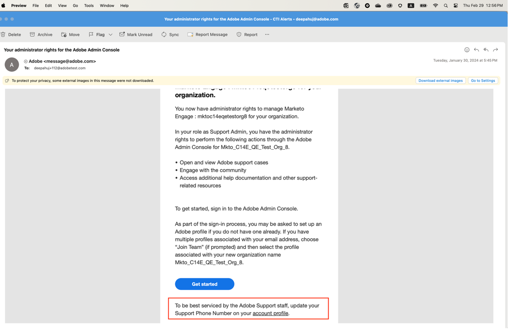
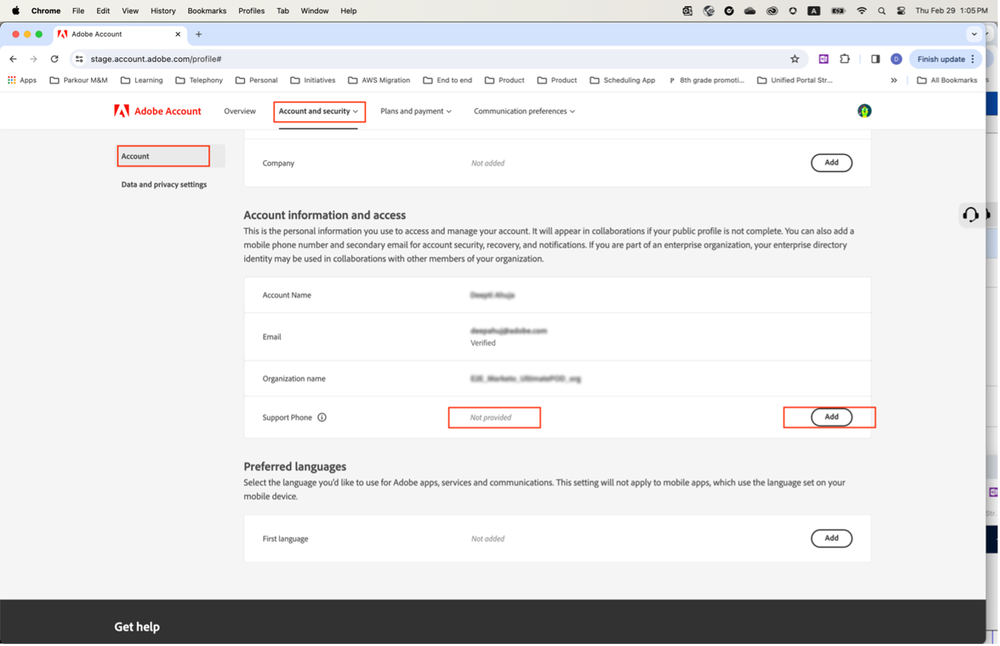

# Support Phone Number update

When a user gets assigned an 'Admin' role such as a 'Product Support Admin', they get an email informing them that they have 'Administrator' rights to manage the instance they have been granted admin rights for.

The email now contains the text below in red telling them to go to their Account profile and share with us their preferred Support Phone Number.

To specify your preferred phone number:

1. Click on the **Account Profile** link to open a new window to sign in using `account.adobe.com`.

   

1. Go through the login process and land on the screen below on `account.adobe.com`.
1. Then click on the below tabs Account and security > Account to see the Support phone number field.
1. Add a phone number here that you would like us to use for recognizing you for your support needs.

